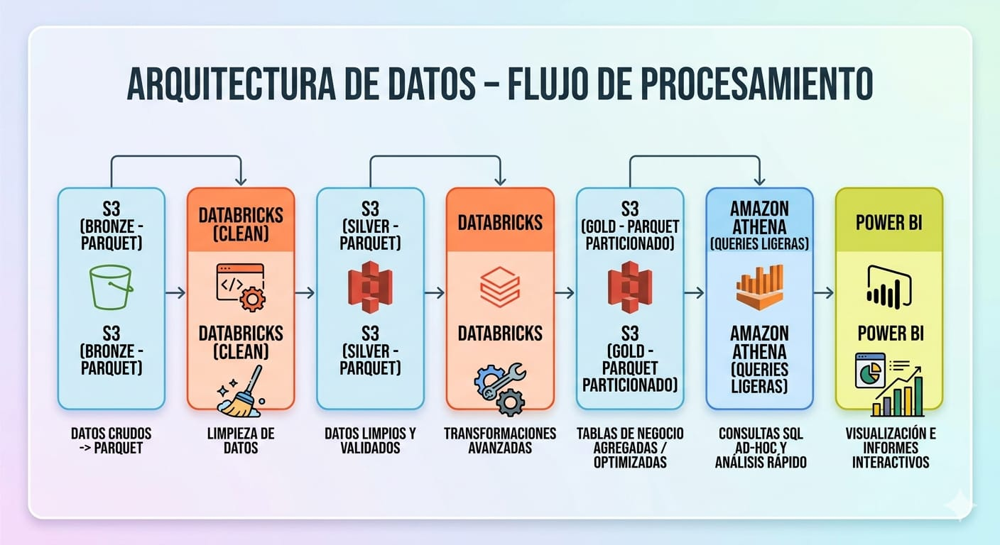

# 📊 Impacto del Riesgo de Crédito (Morosidad/Default) - Banca

## 🔍 1. Problema de Negocio

En el sector bancario, la gestión del riesgo crediticio es clave para proteger la rentabilidad y sostenibilidad de la cartera.

Se identificó una problemática crítica:

> 📉 La existencia de segmentos de clientes con alta probabilidad de default (morosidad), generando pérdidas económicas significativas y una ineficiente asignación del crédito.

### 🚨 ¿Por qué es importante?

✔️ Incrementa las pérdidas financieras de la cartera

✔️ Deteriora la calidad del portafolio crediticio

✔️ Afecta la rentabilidad del negocio

✔️ Reduce la eficiencia en decisiones de otorgamiento de crédito

## 🎯 2. Objetivo del Proyecto

Identificar patrones y segmentos con mayor probabilidad de default, cuantificar su impacto en la cartera y proponer acciones que reduzcan las pérdidas esperadas.

¿Qué se busca resolver?

✔️ Detectar perfiles y segmentos con alta tasa de morosidad

✔️ Medir el impacto económico (pérdida esperada) por segmento

✔️ Identificar outliers y errores de datos que afectan el análisis y el scoring

✔️ Proponer reglas de negocio (bloqueo, límites, reestructuración)

## 🧩 3. Contexto y Supuestos

### 📁 Fuente de datos

Datos sintéticos generados en Python para simular una cartera de crédito real.

👥 Volumen: +10 millones de registros
🏦 Contexto: banca de consumo

### 📌 Variables principales

🔸 credit_score – Score crediticio del cliente

🔸 delinquencies_12m – Mora en los últimos 12 meses

🔸 credit_amount – Monto del crédito

🔸 income – Nivel de ingresos

🔸 age – Edad

🔸 default_flag – Indicador de incumplimiento

### ⚠️ Supuestos y limitaciones

- El default se basa en reglas simuladas

- No se incluyen variables macroeconómicas

- No se modela comportamiento temporal real

- Posibles sesgos en los datos generados

## ⚙️ 4. Proceso Analítico

### 🧹 Limpieza de datos

✔️ Tratamiento de outliers (capping, IQR)

✔️ Transformaciones (log en ingresos)

✔️ Creación de flags de calidad de datos

✔️ Imputación de valores faltantes

### 🔍 Análisis exploratorio (EDA)

✔️ Relación entre variables y default

✔️ Segmentación por score crediticio

✔️ Evaluación del impacto de la mora

✔️ Análisis de variables sin impacto relevante

### 🧠 Enfoque analítico

🔸 Segmentación de clientes por nivel de riesgo

🔸 Identificación de patrones de incumplimiento

🔸 Construcción de variables de negocio (risk_level, has_delinquency)

🔸 Cálculo de pérdida esperada por segmento

## 📊 5. Visualizaciones Clave

Cada visual responde una pregunta crítica de negocio:

📈 ¿Dónde se concentra la pérdida esperada?

📊 ¿Qué segmentos tienen mayor riesgo de default?

📉 ¿Qué variables explican la morosidad?

💰 ¿Cuál es el impacto económico por segmento?

## 💡 6. Hallazgos Principales

❗ La mora (delinquencies_12m) es el principal driver del default

❗ El score crediticio segmenta claramente el nivel de riesgo

❗ La pérdida está altamente concentrada en segmentos específicos

❗ Algunas variables (ej. income, num_prev_loans) no explican significativamente el default

❗ Los outliers pueden distorsionar la medición del riesgo

## 📈 7. Impacto en el Negocio

El análisis revela:

📉 Concentración de pérdidas en segmentos de alto riesgo

💸 Asignación ineficiente de líneas de crédito

📊 Falta de segmentación efectiva en decisiones crediticias

⚠️ Riesgo elevado por falta de control en clientes con mora

## ✅ 8. Reglas de Negocio Propuestas

A partir del análisis, se definen reglas accionables en base al nivel de riesgo:

🔴 High Risk
Score bajo + mora + condiciones críticas
👉 Acción: Bloqueo / Evaluación manual

🟠 Very High Risk
Score bajo + mora
👉 Acción: Reducción de línea de crédito

🟢 Medium/Low Risk
Sin mora
👉 Acción: Mantener / fidelizar

## 📈 9. Impacto Económico

Se cuantifica la pérdida esperada (Expected Loss):

> Expected Loss = Probabilidad de Default × Exposición (monto del crédito).

💰 ¿Qué permite esto?

✔️ Priorizar segmentos con mayor impacto financiero

✔️ Enfocar esfuerzos en reducción de pérdidas

✔️ Evaluar escenarios de mejora

## 🔮 10. Próximos Pasos

🔸 Incorporar LGD y EAD para un modelo más realista

🔸 Integrar datos históricos reales

🔸 Implementar modelos predictivos (Machine Learning)

🔸 Automatizar reglas y alertas de riesgo

## 🛠️ 11. Herramientas Utilizadas

✔️ Databricks (procesamiento distribuido)

✔️ AWS S3 + Athena (almacenamiento y consulta)

✔️ Power BI (dashboard y visualización)

✔️ PySpark / SQL / Python

## 🔄 12. Arquitectura del Proyecto

Se utilizó arquitectura Medallion:

## 📊 13. Dashboard

El dashboard permite:

✔️ Visualizar pérdida esperada por nivel de riesgo

✔️ Identificar segmentos críticos

✔️ Analizar drivers del default

✔️ Proponer acciones de negocio

## 🧠 14. ¿Qué demuestra este proyecto?

✔️ Enfoque en analítica aplicada a banca

✔️ Capacidad de traducir datos en impacto financiero

✔️ Diseño de soluciones end-to-end (data → insight → acción)

✔️ Pensamiento estratégico orientado a reducción de riesgo

## 📌 15. Conclusión

> Este proyecto demuestra cómo, a partir del análisis de datos, es posible identificar segmentos de alto riesgo, cuantificar su impacto económico y definir acciones concretas que permitan reducir las pérdidas esperadas en una cartera de crédito.
